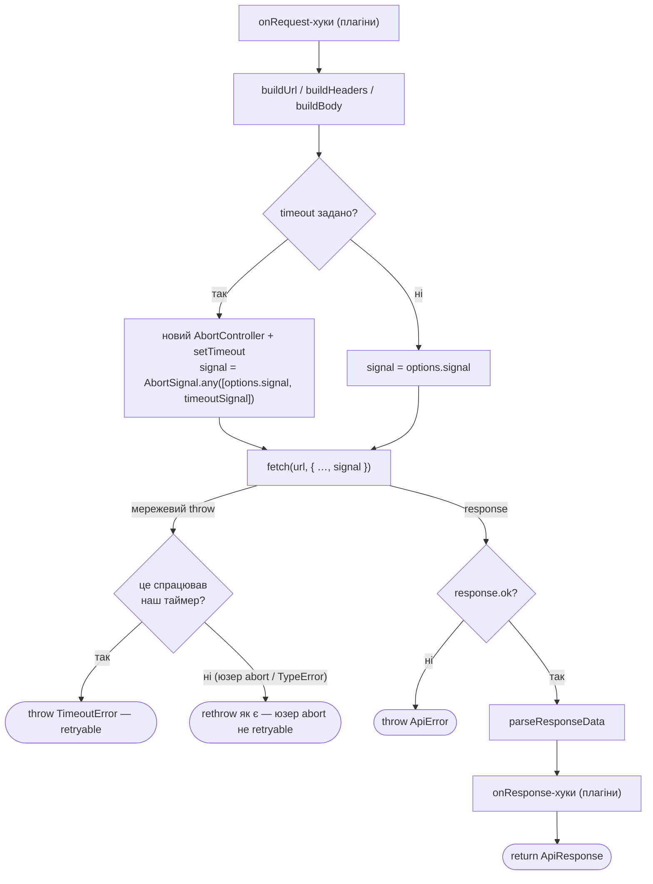
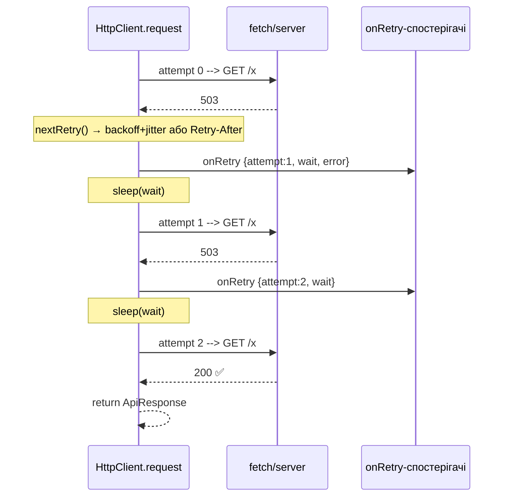

# API Client

Розширюваний HTTP-клієнт на `fetch` з плагінами, ретраями в ядрі, логуванням і
типізованими помилками.

```ts
import { HttpClient } from '@/lib/api';
import { logger } from '@/lib/api/plugins';

const api = new HttpClient('https://example.com', {
  retry: { limit: 3 },
  plugins: [logger({ level: 'info' })],
});

const { data } = await api.get<Post[]>('/posts', { params: { page: 1 } });
```

---

## Життєвий цикл запиту

Два рівні, дві діаграми: (1) зовнішній цикл спроб + обробка помилки, (2) що
відбувається всередині **однієї** спроби. Розбито окремо, бо це буквально два
різні цикли з різною відповідальністю — впихані в одну діаграму вони й давали
той нечитний результат.

### 1. Зовнішній цикл — `request()`


### 2. Одна спроба — `attempt()`



Ключове: `AbortController` на схемі (2) створюється **локально всередині
`attempt()`**, живе рівно одну спробу і викидається. Це і є фікс A1 — старий
timeout-плагін мутував один спільний `options.signal` через усі спроби, тому
після першого таймауту всі наступні відмирали миттєво (весь ретрай-ліміт
згорав без реального очікування). Тепер кожна ітерація циклу (1) отримує
чистий сигнал.

**Таймаут — у ядрі, той самий принцип що й ретрай.** Усе, що керує лайфциклом
*кожної спроби* (per-attempt), належить циклу спроб у ядрі, а не плагіну, який про
цей цикл нічого не знає. Раніше `timeout` був плагіном і мутував спільний
`options.signal` у `onRequest` (викликається на кожну спробу) — коли таймаут
спрацьовував на спробі 1, той самий сигнал лишався aborted назавжди, і кожна
наступна спроба одразу абортилась через `AbortSignal.any`, спалюючи весь ліміт
ретраїв за мілісекунди без реального очікування. Тепер `attempt()` створює
**новий локальний** `AbortController` на кожну спробу і не займає `mergedOptions`,
тому спроби між собою не заважають. Причина аборту розрізняється явно: спрацював
наш таймер → `TimeoutError` (retryable); спрацював юзерський сигнал (скасування з
UI) → пролітає як є, `nextRetry` його не впізнає — не ретраїться.

---

## Коли що спрацьовує

| Хук | Тип | Коли | Може змінити результат? |
|-----|-----|------|--------------------------|
| `onRequest` | плагін | перед кожною спробою (до `fetch`) | так (мутує `options`) |
| `onResponse` | плагін | після успішної відповіді (2xx) | так (напр. валідація) |
| `onError` | плагін (**recovery**) | після помилки, до ретраю | **так** — повернене значення = відновлення, обриває ланцюг |
| `onRetry` | плагін (**observer**) | перед паузою наступної спроби | ні (лише сповіщення) |
| `onFinalError` | плагін (**observer**) | коли ретраї вичерпані / помилка нефатальна для retry | ні |

**Дві ролі плагінів:**
- **Recovery** (`onError`) — лагодить причину й повертає відповідь. Порядок важливий (перший виграє).
- **Observation** (`onRetry` / `onFinalError`) — лише дивиться. **Порядок не важливий.**

---

## Ретраї (у ядрі, не плагін)



Політика — `core/retry-policy.ts`:
- **Backoff + jitter:** `min(maxDelay, delay·2^attempt)`, половина фіксована + половина рандом.
- **Retry-After (429/503):** якщо ≤ `maxRetryAfter` (5 хв) — чекаємо стільки; якщо більше — **give-up** (не марнуємо спробу).
- **Ретрайабельні помилки:** статуси `408/429/500/502/503/504`, `NetworkError`, `TimeoutError`.
  `ValidationError` (Zod-помилка з плагіна `validation`) — **ніколи**: битий за схемою
  респонс не полагодиться повторним запитом, `normalizeError` пропускає її без обгортки
  в `NetworkError`, тому `nextRetry` навіть не бачить її як щось знайоме.
- **Ретрайабельні методи:** `retry.methods`, дефолт — лише ідемпотентні
  `GET/PUT/HEAD/DELETE`. `POST`/`PATCH` **не** ретраяться за замовчуванням (таймаут на
  `POST /orders` міг уже виконатись на сервері — повторний запит = дубль). Опт-ін явно:
  `retry: { methods: ['GET', 'POST'] }` для ендпоінтів, де це безпечно.
- `requestId` **однаковий** на всіх спробах → кореляція логів.

---

## Структура

```
core/
  client.ts         HttpClient: цикл спроб (+ per-attempt timeout) + 3 фази обробки помилки
  retry-policy.ts   resolveRetry, nextRetry (backoff, Retry-After)
  errors.ts         ApiError · NetworkError · TimeoutError
  types.ts          ApiRequestOptions (+ timeout) · ApiPlugin · RetryOptions · RetryInfo
utils/
  url · headers (+X-Request-Id) · body · response · sanitize · request-id
plugins/
  logger/           observer: onRequest/onResponse/onRetry/onFinalError
  validation
clients/
  blog · backend    готові інстанси
```

---

## Плагіни

| Плагін | Хуки | Призначення |
|--------|------|-------------|
| `logger` | onRequest, onResponse, onRetry, onFinalError | кольорові логи (ANSI в TTY), тег `[requestId]`, рівні `silent…debug`, маскування PII |
| `validation` | onResponse | Zod-валідація відповіді |

Таймаут — **не плагін**, опція ядра `timeout?: number` в `ApiRequestOptions`
(як `retry`) — див. розділ вище.

Порядок плагінів впливає лише на `onError` (recovery) — observer-хуки від порядку не залежать.
