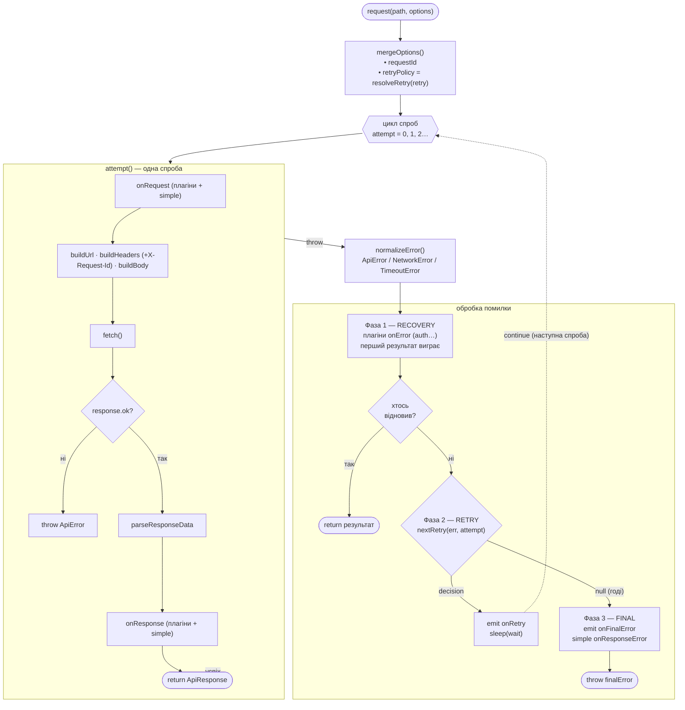
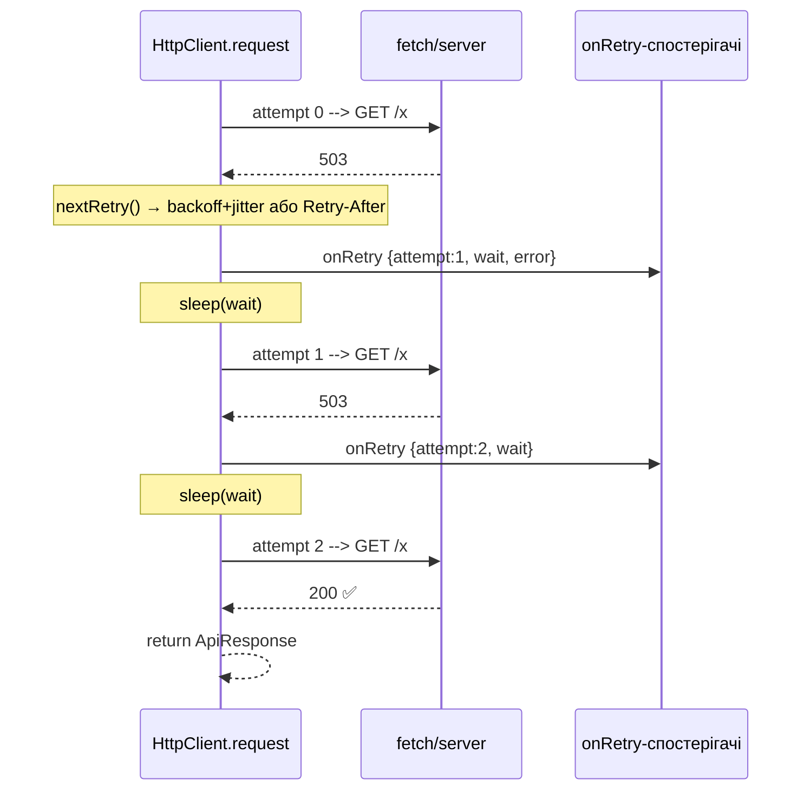

# API Client

Розширюваний HTTP-клієнт на `fetch` з плагінами, ретраями в ядрі, логуванням і
типізованими помилками.

```ts
import { HttpClient } from '@/lib/api';
import { logger } from '@/lib/api/plugins';

const api = new HttpClient('https://example.com', {
  retry: { limit: 3 },
  plugins: [logger({ level: 'info' })],
});

const { data } = await api.get<Post[]>('/posts', { params: { page: 1 } });
```

---

## Життєвий цикл запиту



---

## Коли що спрацьовує

| Хук | Тип | Коли | Може змінити результат? |
|-----|-----|------|--------------------------|
| `onRequest` | плагін | перед кожною спробою (до `fetch`) | так (мутує `options`) |
| `onResponse` | плагін | після успішної відповіді (2xx) | так (напр. валідація) |
| `onError` | плагін (**recovery**) | після помилки, до ретраю | **так** — повернене значення = відновлення, обриває ланцюг |
| `onRetry` | плагін (**observer**) | перед паузою наступної спроби | ні (лише сповіщення) |
| `onFinalError` | плагін (**observer**) | коли ретраї вичерпані / помилка нефатальна для retry | ні |

**Дві ролі плагінів:**
- **Recovery** (`onError`) — лагодить причину й повертає відповідь. Порядок важливий (перший виграє).
- **Observation** (`onRetry` / `onFinalError`) — лише дивиться. **Порядок не важливий.**

---

## Ретраї (у ядрі, не плагін)



Політика — `core/retry-policy.ts`:
- **Backoff + jitter:** `min(maxDelay, delay·2^attempt)`, половина фіксована + половина рандом.
- **Retry-After (429/503):** якщо ≤ `maxRetryAfter` (5 хв) — чекаємо стільки; якщо більше — **give-up** (не марнуємо спробу).
- **Ретрайабельні:** статуси `408/429/500/502/503/504`, `NetworkError`, `TimeoutError`.
- `requestId` **однаковий** на всіх спробах → кореляція логів.

---

## Структура

```
core/
  client.ts         HttpClient: цикл спроб + 3 фази обробки помилки
  retry-policy.ts   resolveRetry, nextRetry (backoff, Retry-After)
  errors.ts         ApiError · NetworkError · TimeoutError
  types.ts          ApiRequestOptions · ApiPlugin · RetryOptions · RetryInfo
utils/
  url · headers (+X-Request-Id) · body · response · sanitize · request-id
plugins/
  logger/           observer: onRequest/onResponse/onRetry/onFinalError
  timeout · validation
clients/
  blog · backend    готові інстанси
```

---

## Плагіни

| Плагін | Хуки | Призначення |
|--------|------|-------------|
| `logger` | onRequest, onResponse, onRetry, onFinalError | кольорові логи (ANSI в TTY), тег `[requestId]`, рівні `silent…debug`, маскування PII |
| `timeout` | onRequest, onResponse, onError | скасування по таймауту (`AbortController`) |
| `validation` | onResponse | Zod-валідація відповіді |

Порядок плагінів впливає лише на `onError` (recovery) — observer-хуки від порядку не залежать.
