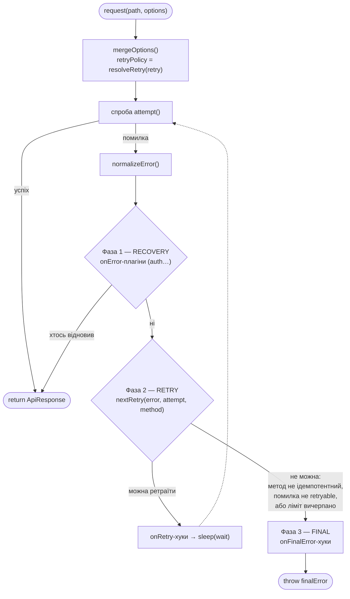
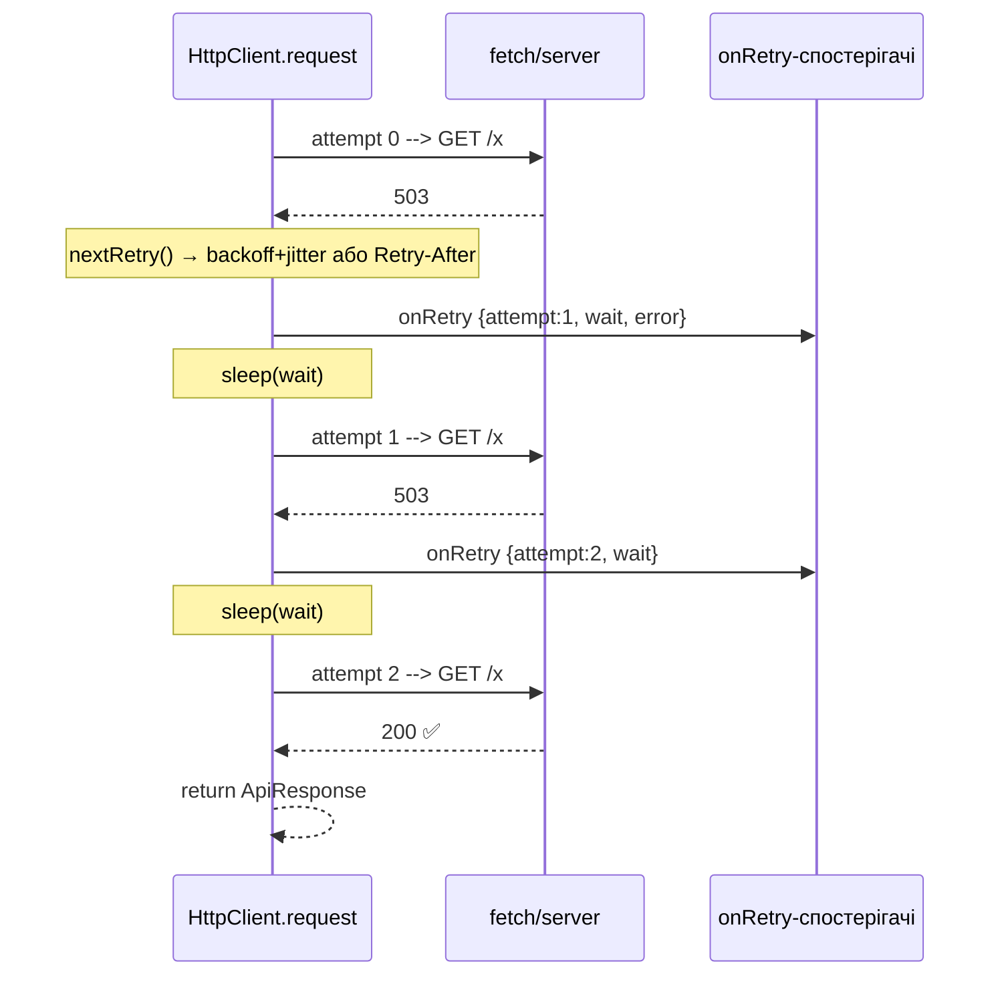
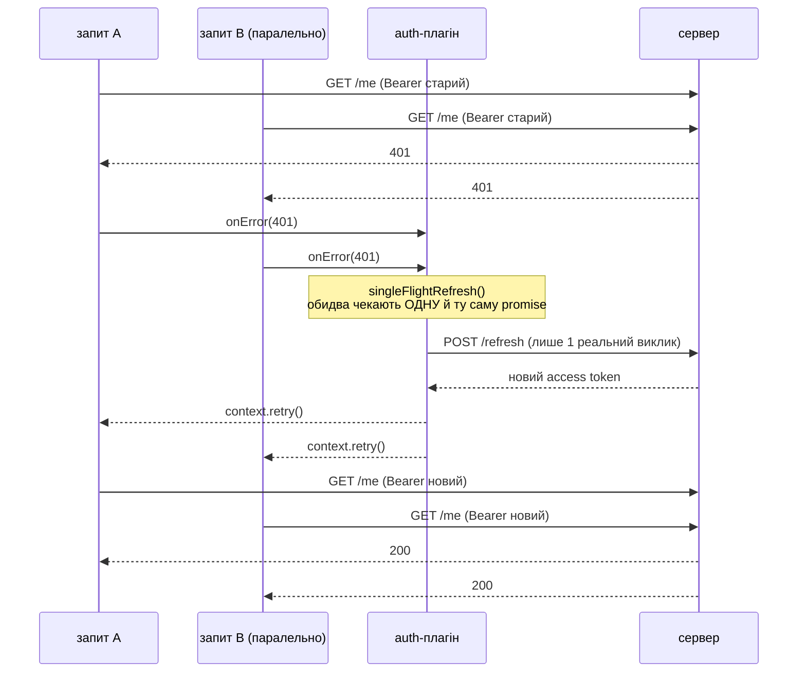

# API Client

Розширюваний HTTP-клієнт на `fetch` з плагінами, ретраями в ядрі, логуванням і
типізованими помилками.

```ts
import { HttpClient } from '@/lib/api';
import { logger } from '@/lib/api/plugins';

const api = new HttpClient('https://example.com', {
  retry: { limit: 3 },
  plugins: [logger({ level: 'info' })],
});

const { data } = await api.get<Post[]>('/posts', { params: { page: 1 } });
```

---

## Життєвий цикл запиту

Два рівні, дві діаграми: (1) зовнішній цикл спроб + обробка помилки, (2) що
відбувається всередині **однієї** спроби. Розбито окремо, бо це буквально два
різні цикли з різною відповідальністю — впихані в одну діаграму вони й давали
той нечитний результат.

### 1. Зовнішній цикл — `request()`



### 2. Одна спроба — `attempt()`


Ключове: `AbortController` на схемі (2) створюється **локально всередині
`attempt()`**, живе рівно одну спробу і викидається. Це і є фікс A1 — старий
timeout-плагін мутував один спільний `options.signal` через усі спроби, тому
після першого таймауту всі наступні відмирали миттєво (весь ретрай-ліміт
згорав без реального очікування). Тепер кожна ітерація циклу (1) отримує
чистий сигнал.

**Таймаут — у ядрі, той самий принцип що й ретрай.** Усе, що керує лайфциклом
*кожної спроби* (per-attempt), належить циклу спроб у ядрі, а не плагіну, який про
цей цикл нічого не знає. Раніше `timeout` був плагіном і мутував спільний
`options.signal` у `onRequest` (викликається на кожну спробу) — коли таймаут
спрацьовував на спробі 1, той самий сигнал лишався aborted назавжди, і кожна
наступна спроба одразу абортилась через `AbortSignal.any`, спалюючи весь ліміт
ретраїв за мілісекунди без реального очікування. Тепер `attempt()` створює
**новий локальний** `AbortController` на кожну спробу і не займає `mergedOptions`,
тому спроби між собою не заважають. Причина аборту розрізняється явно: спрацював
наш таймер → `TimeoutError` (retryable); спрацював юзерський сигнал (скасування з
UI) → пролітає як є, `nextRetry` його не впізнає — не ретраїться.

---

## Коли що спрацьовує

| Хук | Тип | Коли | Може змінити результат? |
|-----|-----|------|--------------------------|
| `onRequest` | плагін | перед кожною спробою (до `fetch`) | так (мутує `options`) |
| `onResponse` | плагін | після успішної відповіді (2xx) | так (напр. валідація) |
| `onError` | плагін (**recovery**) | після помилки, до ретраю | **так** — повернене значення = відновлення, обриває ланцюг |
| `onRetry` | плагін (**observer**) | перед паузою наступної спроби | ні (лише сповіщення) |
| `onFinalError` | плагін (**observer**) | коли ретраї вичерпані / помилка нефатальна для retry | ні |

**Дві ролі плагінів:**
- **Recovery** (`onError`) — лагодить причину й повертає відповідь. Порядок важливий (перший виграє).
- **Observation** (`onRetry` / `onFinalError`) — лише дивиться. **Порядок не важливий.**

---

## Ретраї (у ядрі, не плагін)



Політика — `core/retry-policy.ts`:
- **Backoff + jitter:** `min(maxDelay, delay·2^attempt)`, половина фіксована + половина рандом.
- **Retry-After (429/503):** якщо ≤ `maxRetryAfter` (5 хв) — чекаємо стільки; якщо більше — **give-up** (не марнуємо спробу).
- **Ретрайабельні помилки:** статуси `408/429/500/502/503/504`, `NetworkError`, `TimeoutError`.
  `ValidationError` (Zod-помилка з плагіна `validation`) — **ніколи**: битий за схемою
  респонс не полагодиться повторним запитом, `normalizeError` пропускає її без обгортки
  в `NetworkError`, тому `nextRetry` навіть не бачить її як щось знайоме.
- **Ретрайабельні методи:** `retry.methods`, дефолт — лише ідемпотентні
  `GET/PUT/HEAD/DELETE`. `POST`/`PATCH` **не** ретраяться за замовчуванням (таймаут на
  `POST /orders` міг уже виконатись на сервері — повторний запит = дубль). Опт-ін явно:
  `retry: { methods: ['GET', 'POST'] }` для ендпоінтів, де це безпечно.
- `requestId` **однаковий** на всіх спробах → кореляція логів.

---

## Validation (типізована схема + інференс)

```ts
import { z } from 'zod';
import { HttpClient } from '@/lib/api';
import { validation } from '@/lib/api/plugins';

const PostSchema = z.object({ id: z.number(), title: z.string() });
const api = new HttpClient('https://example.com', { plugins: [validation()] });

const { data } = await api.get('/posts/1', { schema: PostSchema });
//      ^? { id: number; title: string } — виведено зі схеми, без ручного дженерика
```

- `schema?: ZodType` — типізоване поле в `ApiRequestOptions` (не `as any`).
  Валідує **тільки відповідь** (`response.data`) — query-параметри/тіло запиту
  ніхто не перевіряє, це відповідальність виклику.
- **Тип виводиться автоматично** через `InferSchema<O, T>` (`core/types.ts`) — один
  умовний тип на всі методи (`get/post/put/patch/delete`), не перегрузки на кожен.
  Без `schema` — старий ручний дженерик (`client.get<T>(...)`) працює як раніше.
- **`schema` без плагіна `validation()` в `plugins` — типізується, але НЕ
  перевіряється в рантаймі.** Це розв'язані речі: тип виводиться з `options.schema`
  завжди, рантайм-перевірку робить тільки сам плагін своїм `onResponse`. Легко
  забути підключити плагін і думати що застрахований — насправді ні.
- Провалена схема → `ValidationError` (`core/errors.ts`), **ніколи не ретраїться**
  (`normalizeError` пропускає її без обгортки в `NetworkError`) — битий контракт
  не полагодиться повторним запитом.
- Request-level `plugins` **конкатенується** з дефолтними клієнта
  (`[...default, ...request]`, дедуп за `name`, перше входження виграє) —
  передати свій плагін на запиті можна, не втрачаючи `validation()`/`logger`
  клієнта. Плагін з тим самим `name`, що вже є в дефолтних, мовчки
  ігнорується.

Демо: `/plugin-demo/validation`.

---

## Auth (401 → refresh → replay, single-flight)

```ts
import { HttpClient } from '@/lib/api';
import { auth, type TokenProvider } from '@/lib/api/plugins';

const provider: TokenProvider = {
  getToken: () => accessToken,                 // пам'ять (клієнт) / cookies() (сервер)
  refreshToken: () => fetch('/auth/refresh', { method: 'POST' })...,  // сирий fetch!
  onAuthFailure: (error) => { /* logout / redirect */ },
};

const api = new HttpClient('https://example.com', { plugins: [auth(provider)] });
```



- **Токен ніколи не живе в плагіні** — тільки через `TokenProvider` (get/refresh/
  onAuthFailure). На сервері module-scope переживає один запит і ділиться між
  юзерами — токен там тільки з `cookies()` (`next/headers`), ніколи в змінній.
- **Single-flight refresh** — `refreshPromise` живе в замиканні виклику
  `auth(provider)` (не в module-scope файлу), тому 5 паралельних 401 роблять
  **один** реальний refresh, решта чекають ту саму promise. Live-перевірено на
  демо: 5 запитів одночасно → `справжніх refresh-викликів: 1`, навіть коли
  refresh проваливсь для всіх п'яти.
- **Guard проти нескінченного циклу** — `authRetried?: boolean`, типізоване поле в
  `ApiRequestOptions`, виставляється плагіном одразу після успішного refresh, перед
  `context.retry()`. Другий 401 на тому самому запиті (після replay) → сесія
  реально мертва, не просто протух токен → одразу `onAuthFailure`, без другого
  refresh.
- **Фікс ядра, потрібний для цього guard'а:** `context.retry()` раніше реплеїв
  оригінальні `options` (аргумент виклику), не мутований `mergedOptions` —
  мітка `authRetried`, виставлена плагіном на `context.options` (=`mergedOptions`),
  губилась, і guard ніколи б не спрацював. `client.ts` тепер реплеїть
  `mergedOptions`.
- **Refresh-ендпоінт в обхід плагіна** — `provider.refreshToken()` робить сирий
  `fetch`, не через `client` з тим самим `auth()` — інакше 401 на самому
  `/refresh` зациклив би себе через той самий плагін.
- **401 — не ретраїться ядром** (Фаза 2). Якщо recovery не спрацював (guard або
  провалений refresh) — 401 не входить у дефолтні `retry.statusCodes`, тож ядро
  одразу здається, не марнує спроби.
- **Провайдер без `refreshToken`** (статичний токен, як `backendApi` з
  `NEXT_PUBLIC_API_TOKEN`) — 401 фінальний: плагін викликає `onAuthFailure` і
  пропускає **оригінальний** `ApiError` (статус/дані сервера цілі), не підміняє
  його помилкою «нема чим рефрешити». Увага: `NEXT_PUBLIC_*` інлайниться в
  клієнтський бандл — такий токен видно кожному в DevTools; справжній секрет
  живе тільки в server-only env + Route Handler.
- **Dedup + auth:** `dedupe: true` мовчки вимикається, коли запит має
  Authorization/`auth`-плагін — ключ мапи лише URL, і на сервері (module-scope
  синглтон клієнта) дедуп віддав би відповідь одного юзера іншому.

Демо: `/plugin-demo/auth` (мок `/api/mock/auth/{login,refresh,me,logout}`).

**Сервер (RSC / Route Handler / Server Action):** `createServerTokenProvider()`
з `plugins/auth/server-provider.ts` — токен через `cookies()` (`next/headers`),
не module-scope. **RSC-рендер не може писати cookie** (обмеження Next.js) — якщо
всередині рендеру реально знадобиться refresh, `jar.set(...)` кине. Це навмисно:
краще явна помилка, ніж тихо застряглий у мертвій сесії юзер. Рефреш безпечний
лише в Route Handler / Server Action, де `cookies().set()` пише у відповідь, яку
контролює виклик. Це і є Стратегія A з `auth-plugin.md` §4.

**Важливо:** `server-provider.ts` **не** реекспортується з `plugins/auth/index.ts`
(і тому не з `@/lib/api/plugins`) — він імпортує `next/headers`, який ламає збірку,
якщо потрапить у клієнтський бандл через баррель, яким користуються браузерні
клієнтські компоненти. Імпортуй напряму:
`import { createServerTokenProvider } from '@/lib/api/plugins/auth/server-provider'`.

---

## Структура

```
core/
  client.ts         HttpClient: цикл спроб (+ per-attempt timeout) + 3 фази обробки помилки
  retry-policy.ts   resolveRetry, nextRetry (backoff, Retry-After)
  errors.ts         ApiError · NetworkError · TimeoutError · ValidationError · ParseError
  types.ts          ApiRequestOptions (+ timeout, schema, authRetried) · ApiPlugin ·
                     RetryOptions · RetryInfo · InferSchema
utils/
  url (regex абсолютних URL, масиви params) · headers (+X-Request-Id) ·
  body (== null, URLSearchParams) · request-init (toRequestInit — явний
  RequestInit замість спреду в fetch) · response (ParseError на битому JSON) ·
  sanitize · request-id
plugins/
  auth/             onRequest (Bearer) + onError (401 recovery, single-flight refresh);
                     server-provider.ts — окремо, не в барелі (next/headers)
  logger/           observer: onRequest/onResponse/onRetry/onFinalError
  validation
clients/
  blog · backend    готові інстанси
```

---

## Плагіни

| Плагін | Хуки | Призначення |
|--------|------|-------------|
| `auth` | onRequest, onError (**recovery**) | `Authorization: Bearer`, 401 → single-flight refresh → replay |
| `logger` | onRequest, onResponse, onRetry, onFinalError | кольорові логи (ANSI в TTY), тег `[requestId]`, рівні `silent…debug`, маскування PII |
| `validation` | onResponse | Zod-валідація відповіді, типізована схема + інференс |

Таймаут — **не плагін**, опція ядра `timeout?: number` в `ApiRequestOptions`
(як `retry`) — див. розділ вище.

Порядок плагінів впливає лише на `onError` (recovery) — observer-хуки від порядку не залежать.
